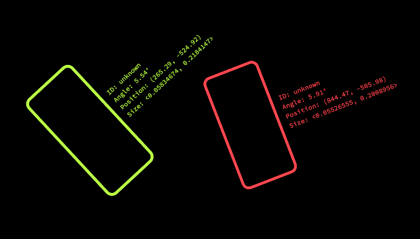
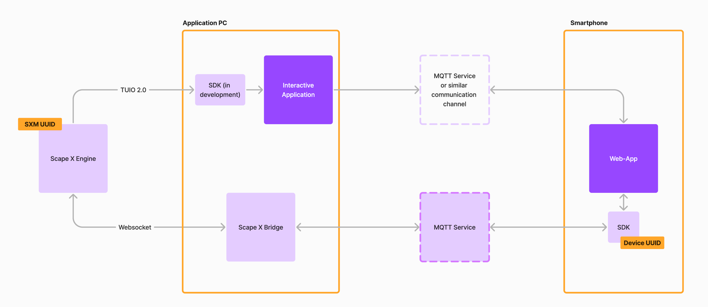

# Scape X Mobile Examples for Unity

In this repository we collect some basic examples how to use our Scape X Mobile technology in applications made with the [Unity](https://unity.com) game engine.

## Setup
The first thing you need to do is to install our [TUIO-Client](https://github.com/InteractiveScapeGmbH/TuioUnityClient) package in order to get touch and object recognition working. For this Example project it is already done.

## Example Scenes
This unity project contains some simple scenes which demonstrates how to set up your project to get Scape X Mobile working. 

**Important:** Scape X Mobile only works with TUIO 2.0. So make sure to select the correct version on the `TuioSession` object.

### Basic
This is a basic scene to demonstrate how to set up everything for touch, object and mobile recognition with TUIO 2.0. 

This setup is sufficient if you don't need to know the exact ID of a smartphone and just want to know **if** there is a smartphone on the table and where it is. You can still distinguish different devices by its `SessionId`.

### Unique ID
With this scene it is possible to distinguish different devices on the screen by a unique device id which stays the same even if you lift the device from the screen and put it back on it. 

1. Press the `Play` button in Unity and scan the QR-Code with your smartphone. This will lead you to a test [webapp](https://interactivescapegmbh.github.io/sxmtest.html).
2. Click `Test Room` (allow the usage for the gyroscope if asked.)
3. Put your smartphone on the touch table. It will now have a unique id which stays the same even if you lift your device up and put it back on the table again.

## How does it work?

### Scape X Engine
The `Scape X Engine` is the software running inside our touch tables. Each table has a unique ID (`SXM UUID`) which by default is the hardware id of the table. You can change this ID in the `Touch & Object Assistant`:
1. Open `10.0.0.20` in your browser
2. At the bottom click `Show Expert-Options`
3. Scroll down to Scape X Mobile
4. Here you can change the Room ID (which is the unique ID) and set a custom MQTT Server Url.

The `Scape X Engine` is responsible for detecting touches, object and smartphones on the touchscreen and sends tuio messages over ethernet to the `Application PC`. For `Scape X Mobile` we use two different Tuio profiles. The `Bounds` message encodes information about the transformation of the device (e.g. position, rotation, width, height...). The `Symbol` message contains the id of the detected device in its `data` field. By default, every phone which gets detected on the table and is not connected to the webapp gets an id of `-1`. As soon as the phone is connected to the webapp and placed on the table it gets its unique id.

The `SDK` mentioned in the overview image is in the case of a unity application the [TuioUnityClient](https://github.com/InteractiveScapeGmbH/TuioUnityClient). 

The `Unique ID` sample scene has a `QrUpdater` component which registers on the `OnConfigUpdate` event of the `ScapeXMobile` component and updates the QR-Code.

This QR-Code contains the URL to the `Web-App`with parameters for the `Room Id` and an optional parameter for the custom `MQTT Server Url` (if set). 

### Web-App
With this example here we provide a test [webapp](https://interactivescapegmbh.github.io/) which does the following:
- The webapp uses the provided `Room Id` and `MQTT Server Url` to connect to the MQTT Server and subscribes to a topic which is the given `Room Id`. 
- It generates a unique id for your smartphone. 
- It uses the gyroscope to detect if the phone is horizontal or vertical and if the phone is in motion or not. (which you can see in the top right corner on the website)

Vertical Moving Phone | Horizontal Stationary Phone
:-------:|:------:
|

- If the smartphone is stationary and horizontal (which could mean it was placed on the table) the webapp sends a message with the unique Id of the smartphone to the MQTT Server.
- 
### MQTT Service
This is the MQTT Broker which distributes messages between the `Web-App` and the `Scape X Engine`. By default, we use the public and free MQTT Broker by [HiveMQ](https://www.hivemq.com/mqtt/public-mqtt-broker/). But of course you can use your own MQTT Broker. You just need to set it in the `Touch and Object Assistant` then.

